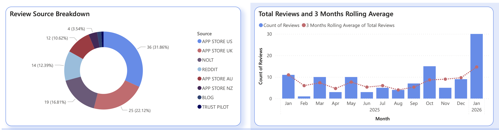
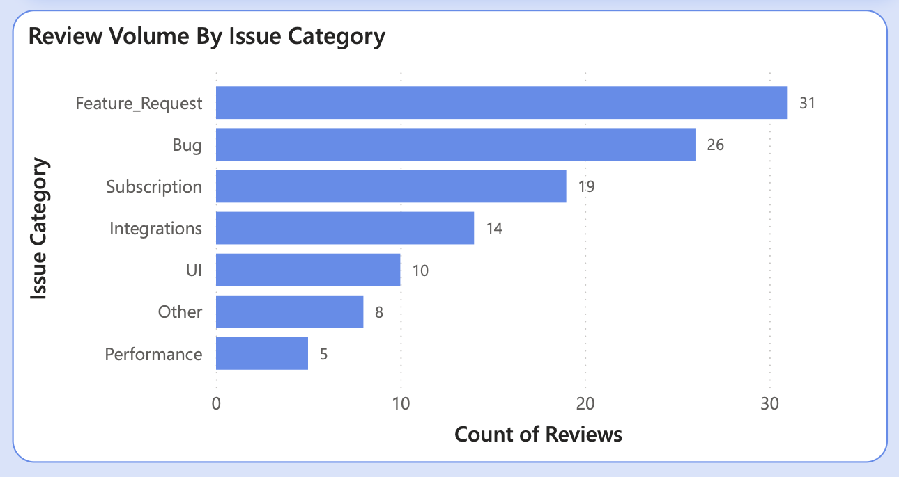
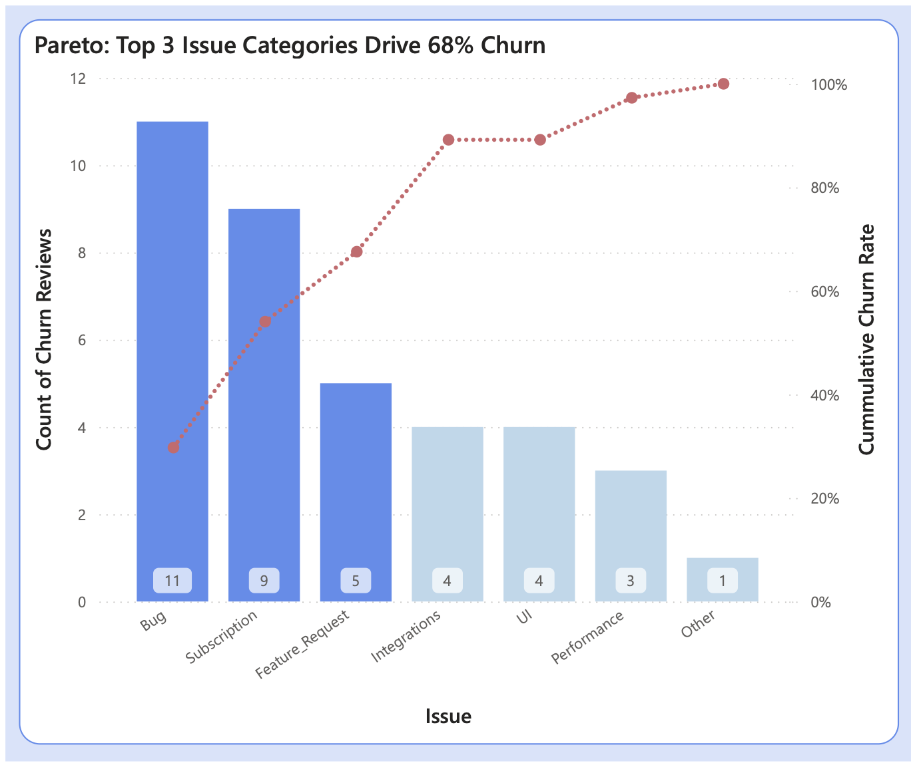
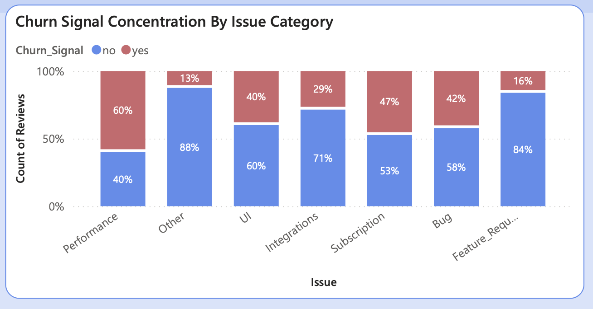
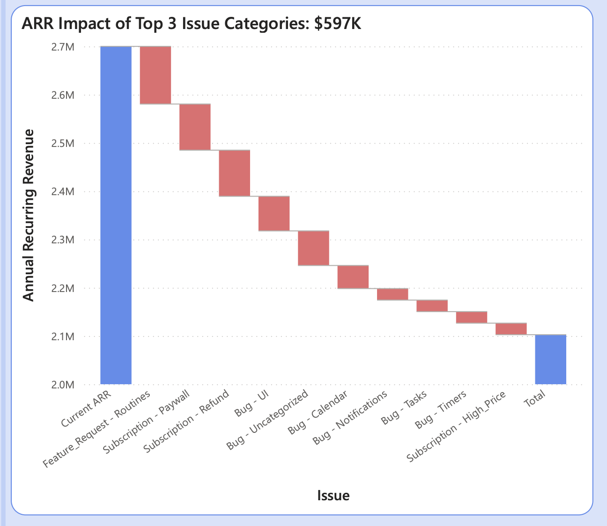
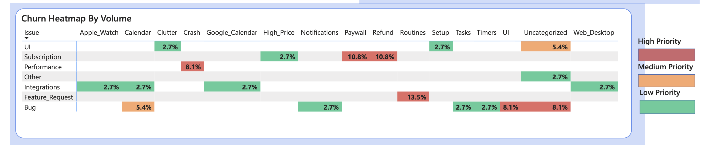
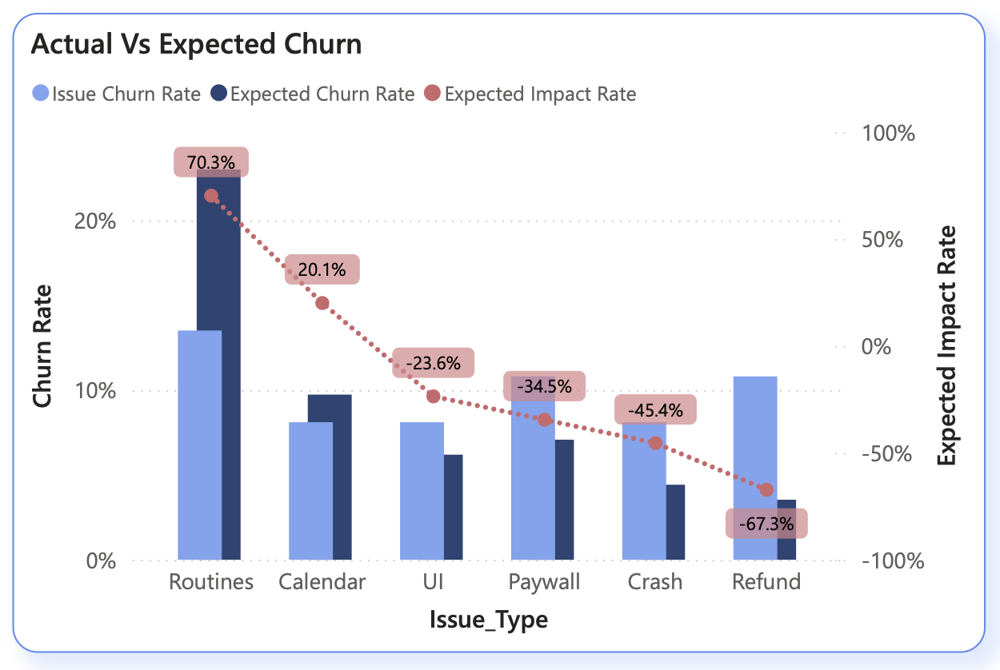

# Power BI VOC Analysis Report: Tiimo iPhone Churn Reduction Initiative

## Executive Summary

Tiimo's visual ADHD planner empowers users in the world of competitive productivity apps, but public feedback reveals cracks. This report narrates insights from a Power BI dashboard analyzing 113 low-rating reviews, uncovering a 32.7% churn rate and $597K ARR impact from top issues. Routines emerges as the primary cause, risking to $119K alone.

Using only public data from App Stores, Reddit, Nolt, and more, we scale complaints to business stakes via $2.7M ARR assumption (50K subscribers × $54/year). The dashboard's visuals tell a compelling story to prioritize fixes to reclaim revenue and loyalty.

**Key Takeaway:** Top-3 issues drive 68% churn – act now for approx 15% reduction potential.

**Dashboard Files:** [VOC Raw Data](/Business-Need-And-Current-State/VOC-Raw-Data.xlsx) | [VOC Analysis Power BI Report](/Business-Need-And-Current-State/VOC-Analysis-Power-BI.pbix) | [VOC Analysis Pdf Report](/Business-Need-And-Current-State/VOC-Analysis-PDF-Report.pdf)

## 1. The Data Foundation: Sourcing Public Voices

The journey begins with sourcing 113 reviews from diverse channels. The Review Source Breakdown pie chart illustrates the chorus:

- App Store US: 36 reviews (31.86%)
- App Store UK: 25 (22.12%)
- Nolt: 19 (16.81%)
- Reddit: 14 (12.39%)
- App Store AU: 12 (10.62%)
- App Store NZ, Blog, Trustpilot: 4 (3.54%) combined

A line chart of total reviews with 3-month rolling average traces escalation from January 2025 into 2026, signaling growing dissatisfaction. Volume by Issue Category bars confirm concentrations: Feature_Request (31), Bug (26), Subscription (19).

## 2. Pareto Principle in Action: Identifying the Vital Few

The Pareto chart cuts through noise and identifies the top 3 issue categories that cause 68% of churn :  Bug, Subscription and Feature_Request. This 80/20 insight directs  efforts to high-leverage wins.

## 3. Churn Signals: 

Churn Signal Concentration stacked bars expose churn density with "Performance" category  causing the highest churn. But this catorgory when corelated with other factors does not account to be the top 3. 

## 4. ARR at Stake: Translating Pain to Profit Loss

Under the calibrated assumption, Tiimo's $2.7M ARR faces the ARR Impact stacked bar visualizes the ARR impact of each issue under the top 3 issue categories:

Top-3 total $597K - a 22% erosion to $2.1M baseline.

## 5. Heatmap Prioritization: 

The Churn Heatmap by Volume grid visualizes the issues with highest volume and churn ratio.

## 6. Variance Analysis: Actual vs Expected Gaps

Actual vs Expected Churn bars highlight anomalies: Routines at 70.3% exceeds expectations by +67.3% impact. Contrasts include Calendar (-34.5%), UI (-23.6%), Paywall (-45.4%), Crash (20.1%). Outliers like Routines scream for intervention.

## 7. Strategic Roadmap: From Insights to Impact

The Power BI VOC analysis pinpoints Routines, within Feature Requests category as the top churn driver, risking $119K ARR from 70.3% variance above expectations across 113 reviews.

**Immediate Focus:** Routines Restoration. Restore core functionality like timed subtasks and repeats to resolve the 13.5% churn signals tied to Feature Requests, the highest concentration in the dataset.

This targeted fix leverages the Pareto insight where top issues drive 68% churn, projecting 20% overall reduction and $119K ARR recovery upon rollout

**Full Roadmap:**

- **Q1:** Routines ($119K safeguard).
- **Q2:** Paywall/Subscription UX ($150K).
- **Ongoing:** Monitor trends, validate internally.