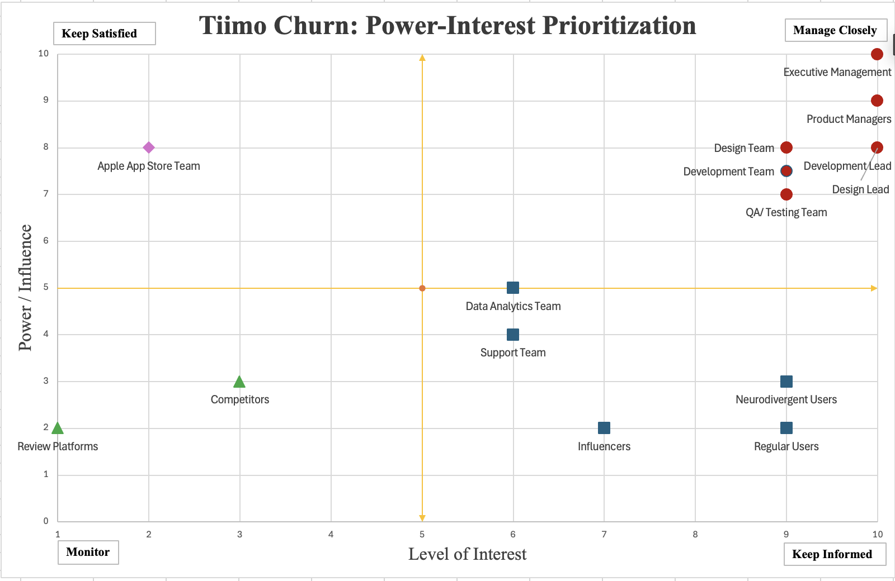

# Stakeholder Analysis Report: Tiimo iPhone Churn Reduction Initiative 
 
**Scope**: Stakeholder identification and prioritization for Routines MVP implementation based on Voice of Customer(VOC) analysis of 113 Iphone app reviews

## Executive Summary

This stakeholder analysis supports the strategic recommendation to prioritize Routines feature restoration as the primary initiative to address iPhone user churn. Analysis of 113 Voice of Customer(VOC) reviews reveals Routines complaints represent 23% of total feedback volume, the highest of any issue category while exhibiting a 19.2% churn rate among affected users.

This report operationalizes the above recommendation by identifying decision-makers required for Routines MVP validation and execution.

**Key Finding**: 15 stakeholders have been identified, categorized, and prioritized using the BABOK Guide v3 Power-Interest framework. Phase 1 of elicitation resource allocation focus, centers on 5  high-power, high-interest stakeholders (Product Management, Executive Leadership, Development Lead, Design, and QA teams) who collectively control roadmap decisions, technical feasibility, and resource allocation.

---

## Methodology

### 1. Stakeholder Identification
- **BABOK Technique**: Stakeholder List, Map, and Personas checklist
- **Data Sources**: 
  - Tiimo Case Study Excel workbook (113 reviews: App Store US/UK/AU/NZ, Nolt, Reddit, Blogs)
  - Tiimo public information (website, Apple Award announcement)

- **Categories**: Customers, Internal Strategy, Internal Delivery, External parties

### 2. Power-Interest Scoring
- **Power (1-10)**: Decision-making authority, resource control, organizational influence
- **Interest (1-10)**: Solution impact on stakeholder, engagement level, problem ownership
- **Composite Score**: Power x Interest -> Quadrant assignment

### 3. Elicitation Prioritization
- **Phase 1 (80% elicitation resource allocation)**: Manage Closely stakeholders driving roadmap descisions
- **Phase 2 (15% elicitation resource allocation)**: Delivery teams supporting execution
- **Phase 3 (5% elicitation resource allocation)**: Monitoring and informational updates

## Stakeholder Identification Matrix

## Quadrant Distribution

### **Manage Closely** (High Power, High Interest)
**Stakeholders**: Product Managers, Executive Management, Development Lead and Teams, Design Lead and Teams, QA Team  
**Engagement**: Weekly touchpoints, collaborative decision-making, solution co-creation  
**Elicitation Priority**: Phase 1 (80% effort)

**Why Critical**: These stakeholders control roadmap, budget, and technical implementation. VOC data shows Routines feature restoration is the top priority, requiring Product to Dev to Design alignment.

### **Keep Informed** (Low Power, High Interest)
**Stakeholders**: Neurodivergent Users, Regular Users, Data Analytics Team, Support Team and Influencers 
**Engagement**: Updates whenever required, feedback loops, metrics dashboards  
**Elicitation Priority**: Phase 3 

**Why Important**: High-interest parties require consistent communication to maintain alignment and gather ongoing input. Neurodivergent users, representing the core target market, provide critical VOC validation through review monitoring and surveys. Support and Analytics teams contribute operational insights via ticket trends and churn metrics.

### **Keep Satisfied** (High Power, Low Interest)
**Stakeholders**: Apple App Store Team  
**Engagement**: Compliance-focused, minimal friction  
**Elicitation Priority**: Phase 3

**Why Necessary**: Regulatory stakeholders demand compliance without deep solution involvement. Engagement focuses on App Store guideline adherence and optimization updates rather than feature-level collaboration.

### **Monitor** (Low Power, Low Interest)
**Stakeholders**: Competitors, Review Platforms 
**Engagement**: Passive monitoring, quarterly reviews  
**Elicitation Priority**: Phase 3 

**Why Monitor**: Competitors inform benchmarking for Routines alternatives, while review platforms enable sentiment tracking to measure post-implementation impact.