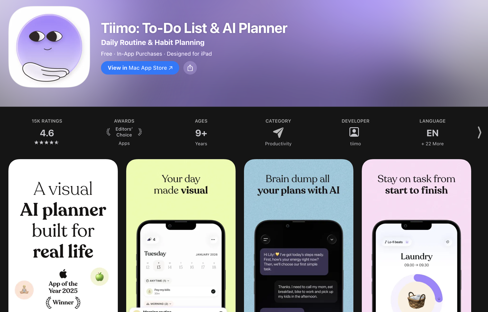

# Tiimo-Case-Study
Tiimo Churn Analysis: Business Analysis Case Study on Apple's App of the Year

  

  <strong>Voice of Customer • Churn Analysis • Prioritization • Requirements Engineering • Delivery Readiness</strong>

  <a href="./Business-Need-And-Current-State/VOC-Analysis-PDF-Report.pdf">📊 VOC Dashboard</a> •
  <a href="./Requirements-Analysis-And-Prioritization/Decision-Analysis.md">🎯 Decision Analysis</a> •
  <a href="./Requirements-Documentation-And-Traceability/Requirements-Catalog-Tiimo.xlsx">📋 Requirements Catalog</a> •
  <a href="./Requirements-Documentation-And-Traceability/Requirments-Traceability-Matrix.xlsx">🔗 Traceability Matrix</a> •
  <a href="./Implementation-And-Validation/Routines-MVP-Implementation-Plan.md">🚀 Implementation Plan</a>

---

## 📌 Overview

Tiimo, winner of Apple’s 2025 iPhone App of the Year award for ADHD productivity planning, faces significant user churn despite critical acclaim.

This business analysis case study uses a voice-of-customer dataset of 113 low-rating reviews collected from App Store markets, Nolt, Reddit, blogs, and Trustpilot to identify the primary churn driver, quantify business impact, and define a prioritized response.

> [!IMPORTANT]
> **Problem Statement**  
> Despite industry recognition, Tiimo shows strong dissatisfaction signals among low-rating users. The objective of this case study was to quantify the most important complaint themes, validate their relationship to churn risk, and translate those findings into actionable, traceable requirements that could reduce attrition.

> [!TIP]
> **Executive Summary**  
> The analysis found that 32.7% of the reviewed sample carried churn signals, the top three issue categories accounted for 68% of churn impact, and the modeled business case indicated $597K ARR at risk. Within that pattern, Routines emerged as the most important intervention, with approximately $119K in recovery potential under the full-restoration scenario. A **Core Routines MVP** was then selected as the preferred recommendation because it offered the strongest balance of user value, commercial impact, delivery effort, and technical feasibility.

---

## 🗂️ Table of Contents

- [Business Context](#-business-context)
- [Key Findings](#-key-findings)
- [Analytical Approach](#-analytical-approach)
- [Recommendation](#-recommendation)
- [BA Skills Demonstrated](#-ba-skills-demonstrated)
- [AI-Assisted Analysis](#-ai-assisted-analysis)
- [Featured Artifacts](#-featured-artifacts)
- [Supporting Documentation](#-supporting-documentation)

---

## 📉 Business Context

Tiimo’s brand position and product recognition suggest a strong market presence, yet public review data reveals clear dissatisfaction among low-rating users. The complaint pattern is not random or isolated. Instead, the evidence shows concentration around a small number of recurring themes, especially Feature Requests, Bugs, and Subscription-related friction.

Within that pattern, the removal of **Routines** emerged as the most strategically important issue. It appears repeatedly across sources as both a usability loss and a retention risk, especially for neurodivergent users who relied on timed subtasks, saved routine flows, and structured visual guidance.

  

---

## 📊 Key Findings

| Metric | Finding |
|---|---|
| Reviews analyzed | 113 low-rating reviews across public channels |
| Churn signal rate | 32.7% of the reviewed sample carried churn signals |
| Top churn concentration | The top three issue categories account for 68% of churn impact |
| Largest complaint theme | Routines complaints account for about 22.12% of issue volume |
| Routines recovery opportunity | Approximately $119K under the full-restoration scenario |
| Selected option | Core Routines MVP |
| Decision score | 92/100 |
| Delivery feasibility | 4 sprints |
| Budget assumption | $50K |

> [!NOTE]
> The central business insight was that Routines was not just a highly requested feature. It was the most important overlap between customer frustration, churn risk, competitive parity, and measurable business value.

---

## 🔍 Analytical Approach

The case study began with structured voice-of-customer analysis using a tagged review dataset. Reviews were organized by issue, sub-theme, churn signal, and requirement grouping.

Stakeholder analysis and elicitation then validated the business case and shaped solution scope. High-power, high-interest stakeholders were prioritized because they controlled roadmap direction, budget, UX decisions, and technical feasibility. Competitive benchmarking, Kano analysis, and decision analysis were then used to compare alternatives and identify the most viable scope for intervention.

The requirements documentation was created to make the analysis easy to follow and ready for delivery. MVP Scope was linked to requirement IDs, user stories, acceptance criteria, and test cases, which created a clear path from review insight to implementation-ready deliverables. 

### Analysis methods used

- Affinity analysis and thematic clustering
- Churn signal mapping
- Stakeholder analysis using a Power-Interest framework
- Elicitation planning and results logging
- Competitive feature benchmarking
- Kano-based MVP prioritization
- Multi-criteria decision analysis
- Requirements traceability and test alignment
- Agile implementation planning and KPI definition

---

## 🎯 Recommendation

The final recommendation is the restoration of a **Core Routines MVP** for the Tiimo iPhone app.

This option was selected because it delivered the strongest balance of value and feasibility. It captured a high share of modeled ARR recovery, addressed the most important churn driver in the dataset, and remained achievable within a validated 4-sprint delivery window. It also reduced the risk of reintroducing excessive complexity by focusing only on the smallest coherent set of capabilities needed to restore user value.

### Recommended MVP scope

| Priority area | Included in MVP | Why it matters |
|---|---|---|
| Routine creation | ✅ Yes | Restores the core missing workflow |
| Visual timers | ✅ Yes | Supports time awareness and task progression |
| Save and deploy library | ✅ Yes | Reintroduces reusable routines |
| Crash-free performance | ✅ Yes | Reduces frustration and churn risk |
| Calendar sync | ✅ Yes | Addresses recurring integration complaints |
| Conflict checks | ✅ Yes | Supports realistic daily planning |
| Accessibility | ✅ Yes | Improves neuroinclusive usability |
| FAQ and onboarding video | ✅ Yes | Reduces adoption friction after release |

  

> [!IMPORTANT]
> **Recommendation Rationale**  
> The Core Routines MVP outperformed full restoration and stability-only alternatives because it preserved most of the modeled business value while staying inside realistic technical constraints. Publicly available evidence and the case study’s constraint analysis suggested that the original removal of Routines was linked to complexity, stability concerns, and underlying technical debt, so the recommended MVP scope was intentionally defined to address those limitations rather than recreate the full legacy solution.This made it the strongest option from both a BA and product decision-making perspective.

---

## 🧩 BA Skills Demonstrated

| BA Capability | How this case study demonstrates it |
|---|---|
| ⭐ Problem framing | Customer pain was translated into churn signals, ARR exposure, and a defined business problem. |
| 👥 Stakeholder management | Stakeholders were prioritized through a Power-Interest framework, enabling targeted elicitation on the groups with the greatest influence over scope, budget, design, and delivery. |
| 🧠 Analysis mastery | Affinity analysis, churn mapping, competitive benchmarking, Kano analysis, and decision analysis were used together to form a defensible recommendation. |
| 📋 Requirements engineering | Customer evidence was translated into business requirements, functional requirements, non-functional requirements, user stories, acceptance criteria, and test cases. |
| 🔗 Traceability | The case study maintains line-of-sight from VOC evidence to requirement IDs, stories, acceptance criteria, and validation artifacts. |
| ⚖️ Decision quality | Multiple scope alternatives were evaluated using weighted criteria. |
| 🚀 Delivery readiness | The recommendation is backed by a roadmap, governance gates, KPIs, and implementation planning. |
| 💼 Business impact orientation | The case study consistently frames product change in terms of value, feasibility, and measurable outcomes. |

---

## 🤖 AI-Assisted Analysis

This case study also highlights the use of AI in a disciplined business analysis workflow.

AI-assisted review tagging and clustering were used to help structure raw feedback into recurring themes, churn signals, and candidate requirement groupings. Those outputs were then validated through BA judgment and translated into prioritization logic, requirements, and delivery planning.

AI was also used to support parts of the case study writing process, including drafting, editing, and improving the clarity of documentation and portfolio presentation. Final decisions on analytical interpretation, prioritization, requirements definition, and written content remained grounded in BA judgment and manual review.

---

## 🧭 Assumptions and Case Study Boundaries

This case study was developed as a portfolio project using publicly available voice-of-customer data rather than internal company access. The review dataset, issue tagging, churn-signal analysis, and competitive observations are based on real public sources, but they should be interpreted as directional evidence rather than as a complete representation of Tiimo’s internal customer, product, or financial data.

Several parts of the business case were therefore modeled hypothetically. ARR exposure, churn impact, and recovery opportunity were built as scenario-based estimates anchored to public user and pricing assumptions, not to Tiimo’s internal cohort, subscription, or feature-usage analytics.

The stakeholder interviews, elicitation outputs, feasibility confirmations, and internal alignment artifacts were created as simulated BA deliverables to demonstrate how a real engagement would validate VOC-based hypotheses with Product, Design, Engineering, Data, and Executive stakeholders. These artifacts are intended to show business analysis method, structure, and documentation quality under realistic constraints, not to imply direct collaboration with Tiimo’s internal teams.

For that reason, the recommendation should be read as a hypothesis-led business case. It demonstrates the skills of Business Analysis to move from public customer evidence to structured problem framing, requirements, prioritization, and delivery planning even when internal data is unavailable

---

## 🧾 Featured Artifacts

### Executive and analytical artifacts

| Artifact | Purpose |
|---|---|
| [VOC Analysis Power BI Report](./Business-Need-And-Current-State/VOC-Analysis-Power-BI.pbix) | Summarizes VOC findings, churn concentration, and ARR exposure |
| [VOC Analysis PDF Dashboard](./Business-Need-And-Current-State/VOC-Analysis-PDF-Report.pdf) | Provides executive visuals for scan-friendly review |
| [Affinity & Traceability Analysis](./Requirements-Documentation-And-Traceability/Affinity_Traceability_Analysis_Tiimo.xlsx) | Shows tagged review data, theme clustering, churn mapping, and requirement links |
| [Stakeholder Analysis](./Stakeholder-Engagement-And-Elicitation/Stakeholder-Analysis.md) | Documents stakeholder prioritization and engagement logic |
| [Elicitation Plan](./Stakeholder-Engagement-And-Elicitation/Elicitation-Plan.md) | Defines stakeholder engagement strategy and elicitation structure |
| [Elicitation Results Log](./Stakeholder-Engagement-And-Elicitation/Elicitation-Results-Log.md) | Records validation outcomes, feasibility findings, and key decisions |
| [Competitive Feature Parity Matrix](./Stakeholder-Engagement-And-Elicitation/Competitive-Feature-Parity-Matrix.md) | Benchmarks Tiimo against key alternatives |

### Prioritization and decision artifacts

| Artifact | Purpose |
|---|---|
| [Kano Analysis PDF](./Requirements-Analysis-And-Prioritization/Kano-Analysis.pdf) | Explains VOC-based Kano prioritization for MVP scoping |
| [Decision Analysis](./Requirements-Analysis-And-Prioritization/Decision-Analysis.md) | Shows alternative comparison and the rationale for selecting the Core Routines MVP |
| [Risk Log](./Requirements-Analysis-And-Prioritization/Risk-Log.md) | Captures key implementation and governance risks |
| [BPMN Process Design](./Requirements-Analysis-And-Prioritization/BPMN-Process-Design.md) | Displays the current state and future to-be state of the app |

### Requirements and delivery artifacts

| Artifact | Purpose |
|---|---|
| [Requirements Catalog](./Requirements-Documentation-And-Traceability/Requirements-Catalog-Tiimo.xlsx) | Defines business, functional, non-functional, stakeholder, and transition requirements |
| [Requirements Traceability Matrix](./Requirements-Documentation-And-Traceability/Requirments-Traceability-Matrix.xlsx) | Links VOC evidence to requirements, user stories, acceptance criteria, and test cases |
| [User Stories](./Requirements-Documentation-And-Traceability/User-Stories.md) | Provides delivery-ready stories and acceptance criteria |
| [Test Cases](./Implementation-And-Validation/Test-Cases.md) | Defines verification coverage for the MVP |
| [Implementation Plan](./Implementation-And-Validation/Routines-MVP-Implementation-Plan.md) | Describes roadmap, governance, and success metrics |
| [Gantt Chart](./Implementation-And-Validation/Gantt%20Chart.xlsx) | Shows delivery sequencing and release planning |

---

## 🚀 Delivery Readiness

The recommendation does not stop at insight generation. It is supported by a delivery-ready plan that includes sprint sequencing, requirement coverage, governance checkpoints, and post-launch KPI monitoring.

The implementation roadmap translates the recommendation into a practical release path with clear milestones, ownership structure, and measurable success criteria. This helps position the case study not only as an analytical exercise, but as a realistic BA deliverable set that could support downstream product execution.

  

### Planned success measures

- 70% adoption target for the MVP
- 0.5-star rating uplift target
- 99% crash-free experience target
- ARR recovery monitoring against the Routines business case
- Post-launch review monitoring for churn signal reduction

---

## 📚 Supporting Documentation

<strong>Open supporting artifacts</strong>

### Additional analysis and governance documents

- [Affinity Traceability Analysis](./Requirements-Documentation-And-Traceability/Affinity_Traceability_Analysis_Tiimo.xlsx)
- [Assumptions and Limitations Log](./Business-Need-And-Current-State/Assumptions-Limitations-Log.md)
- [VOC Raw Data](./Business-Need-And-Current-State/VOC-Raw-Data.xlsx)

---

## ✅ Conclusion

This case study presents a complete business analysis journey from VOC signal detection through recommendation, requirements engineering, and implementation planning.

The final recommendation focuses on a **Core Routines MVP** because it addresses the strongest churn driver, aligns with stakeholder and feasibility evidence, and offers the clearest path to measurable business impact.

---

## 👤 Portfolio Note

This case study is intended to demonstrate end-to-end business analysis capability across:

- Problem framing
- VOC analysis
- Stakeholder management
- Elicitation planning
- Prioritization
- Requirements engineering
- Traceability
- Solution evaluation
- Delivery planning
- Outcome measurement
- AI-assisted analytical support   

 

  <strong>If you are reviewing this portfolio piece, the best place to start is the VOC dashboard, the decision analysis, the requirements traceability matrix and the implementation plan.</strong>

