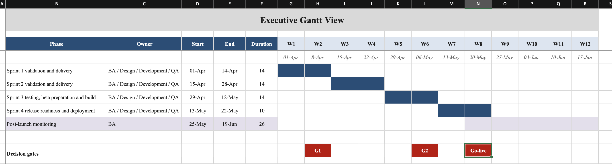

# Phase 2 Implementation Roadmap: Tiimo iPhone Churn Reduction 

## Executive Summary

This roadmap details the 4 sprint implementation of the Routines MVP to address 13% of iPhone churn complaints identified in VOC analysis. BA oversight ensures full traceability to all requirement types (functional, NFR, stakeholder, business, transition) across execution

## Project Governance

- **Methodology**: Agile with 2-week sprints and formal Go/No-Go gates.
- **Budget**: $50k covering development, QA, and beta testing.
- **Success Criteria**: 70% user adoption, 0.5 rating uplift, 99% crash-free sessions by Week 12.

## RACI Responsibility Matrix

| Activity | Business Analyst | Project Manager | Development Lead | Designer | QA Engineer | Executive Sponsor |
|----------|------------------|-----------------|------------------|----------|-------------|-------------------|
| Sprint Planning | Responsible/Accountable | Consulted | Informed | Informed | Informed | Informed |
| Requirements Validation | Responsible/Accountable | Consulted | Responsible | Responsible | Consulted | Informed |
| User Acceptance Testing | Responsible | Accountable | Consulted | Informed | Responsible/Accountable | Responsible |
| Production Deployment | Consulted | Accountable | Responsible | Informed | Responsible | Accountable |
| Post-Launch Monitoring | Responsible/Accountable | Responsible | Informed | Informed | Informed | Consulted |

## Detailed Sprint Schedule with Full Requirements Mapping

Each sprint delivers traceable requirements from the full catalog.

| Sprint | Timeline | Requirements Delivered | Key Deliverables | Success Metrics | Risks and Mitigations |
|--------|----------|------------------------|------------------|-----------------|-----------------------|
| Sprint 1 | Weeks 1-2 | **BR-01** Churn Reduction ARR, **FR-01** Routine Creation, **FR-02** Visual Timer, **SR-01** ADHD Timed Flow, **NFR-01** Routine Creation Time, **NFR-02** Screen Load Performance | Routine editor prototype, timer engine refactor, 80% unit test coverage | Code coverage >80%, creation time <2 minutes | Medium: Technical debt. Mitigation: Prioritize refactor; escalate if effort variance >10%. |
| Sprint 2 | Weeks 3-4 | **FR-03** Library Save, **FR-04** Server Expansion, **SR-04** Dev Timer Refactor, **NFR-03** 99% Crash-Free | Persistence layer, 14-day server expansion, integration tests | 99% crash-free sessions, sync latency <5 seconds | Low: Server performance. Mitigation: Execute load tests; fallback to client-side if needed. |
| Sprint 3 | Weeks 5-6 | **FR-05** Calendar Sync, **FR-06** Batch Add, **SR-02** MVP Delivery, **SR-03** NeuroInclusive Design, **NFR-04** WCAG AA Accessibility | Bi-directional sync, batch creation with progress tracking, complete feature testing, beta release build | Sync accuracy | Medium: User experience friction. Mitigation: A/B testing; rollback to Sprint 2 if unresolved. |
| Sprint 4 | Weeks 7-8 | **FR-07** Conflict Check, **BR-02** Adoption KPI, **SR-06** Product Roadmap, **TR-01** Routines User FAQ, **TR-02** Onboarding Video | Overlap resolution, production release, handover documentation | beta retention >60% | High: Adoption lag. Mitigation: Deploy onboarding video; continuous VOC monitoring. |

## Go/No-Go Decision Gates

Formal gates ensure alignment with business objectives and full requirements coverage.

1. **End of Sprint 1**: Confirm MVP scope and solution feasibility (scope freeze). Inputs: BR-01, FR-01/FR-02 validated.
2. **End of Sprint 3**: Achieve beta UAT success (quality readiness). Inputs: FR-05/FR-06, NFR-04 tested.
3. **Pre-Production (Sprint 4)**: Secure Executive approval based on ARR projections (go-live decision). Inputs: BR-02, TR-01/TR-02 ready.

## Post-Launch Monitoring Plan (Weeks 9-12)

Continuous monitoring validates ROI across all requirement types.

- **KPIs**: Track adoption (BR-02), ratings (SR-01), churn cohorts against VOC baseline.
- **Feedback Loop**: Weekly review of Reddit, Nolt, App Store VOC; prioritize iterations if adoption <70%.
- **ROI Validation**: Quarterly ARR report confirming $105k uplift trajectory (BR-01).

## Traceability and References

This roadmap maintains full bidirectional traceability to:
- [Gantt Chart](Gantt%20Chart.xlsx)
- [Requirements Catalog](Requirements-Catalog-Tiimo.xlsx)
- [Test Cases](Test-Cases.md)
- [Decision Analysis](Decision-Analysis.md)
- [Risk Log](../Requirements-Elicitation/Risk-Log.md)